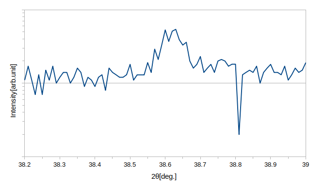

# py-xrd-visualize

this software is for visualizing xrd data.
2θ/ω scan,ω scan(Rocking Curve) and φ scan are supported.

# install
* python ver >= 3.10
```bash
pip install py-xrd-visualize
```
## dependencies
* matplotlib
* numpy
* scipy

# enviroment
* Linux (developed on) 
## no check,but it will run
* windows
* mac

# pypi
[py-xrd-visualize](https://pypi.org/project/py-xrd-visualize/)

# usage
see [test_xrd](src/test/test_xrd.py)

```python
    import matplotlib.pyplot as plt

    from py_xrd_visualize.xrd import (
        fig_2θ_ω_1axis,
        fig_φ_scan_1axis,
        fig_ω_scan_1axis,
    )
    def plot_2θ_ω_1axis():
        paths: list[TextIOBase | str | Path] = list(
            map(lambda x: Path("src/test/") / x, ["test.xy"] * 2)
        )

        print(paths)
        fig = fig_2θ_ω_1axis(
            paths,
            [1, 1, 1],
            legends=["test1", "test2", "test3"],
            legend_title="2th omega",
            legend_reverse=True,
            range_=(10, 70),
            # range_=(38.2, 39.0),
            ax_func=ax_func_horizontal_annotates(
                10,
                [
                    Annotater(38.5, 0, "38.5,10-5", (0.0, -5)),
                    Annotater(38.7, 0, "aaaa"),
                ],
            ),
            fig_conf=fig_conf_show(figratio=(5, 6)),
        )
        plt.show()
```

